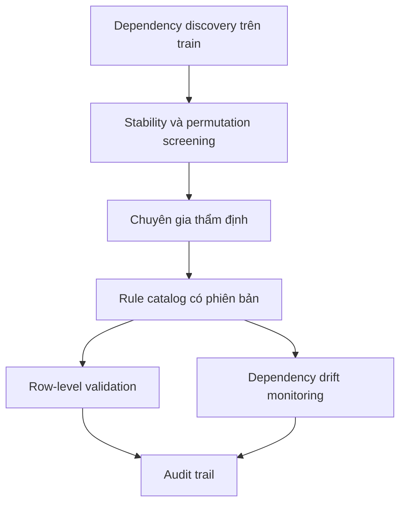

# ACSIncome Business Rule Gap

## Khung đánh giá khoảng cách giữa dependency mining và quy tắc nghiệp vụ

Dự án nghiên cứu cách kết hợp khai phá quan hệ phụ thuộc từ dữ liệu với tri thức chuyên gia trong quản trị chất lượng dữ liệu. Bộ dữ liệu thực nghiệm là **ACSIncome**; đầu ra gồm controlled benchmark, danh sách dependency ứng viên, row-level validation và cảnh báo dependency drift.

> **Giới hạn quan trọng:** rule catalog trong controlled benchmark là bộ quy tắc mô phỏng do người nghiên cứu thiết kế. Đây không phải rule chính thức của ACS và kết quả tìm lại rule không được diễn giải thành bằng chứng rằng máy đã tự khám phá tri thức nghiệp vụ thực tế.

## Phiên bản V4

Notebook mới: [`ACSIncome_BusinessRule_V4.ipynb`](ACSIncome_BusinessRule_V4.ipynb)

V4 tách hai tuyến bằng chứng:

1. **Controlled benchmark:** đo khả năng tìm lại rule đã biết và phát hiện lỗi được tiêm có kiểm soát.
2. **Raw-variable candidate discovery:** tìm dependency ổn định giữa các biến ACS gốc bằng bootstrap stability selection, permutation test và FDR; mọi kết quả chỉ là ứng viên chờ chuyên gia thẩm định.

Các sửa đổi chính:

- sửa Theil’s U về cùng đơn vị log, nên quan hệ hoàn hảo đạt 1 thay vì khoảng 0,693;
- chuẩn hóa QStrength về [0,1];
- DDS chỉ tính ngoài đường chéo và so sánh cùng vị trí dòng;
- leave-one-state-out tự loại `state` khỏi ma trận dependency;
- thêm kiểm soát cardinality/support;
- thêm permutation test và Benjamini–Hochberg FDR;
- thêm negative control để phát hiện lập luận vòng tròn;
- tách mã nguồn có thể kiểm thử khỏi notebook.

Thiết kế và cách diễn giải chi tiết nằm trong [`METHODOLOGY_V4.md`](METHODOLOGY_V4.md).

## Cấu trúc repository

```text
.
├── ACSIncome_BusinessRule_V4.ipynb      # notebook thực nghiệm mới
├── CĐPTDL_ACSIncome-BusinessRule.ipynb  # notebook V3.1 giữ để đối chiếu
├── METHODOLOGY_V4.md                    # thiết kế nghiên cứu và threats to validity
├── pyproject.toml                       # cấu hình package và dependency
├── requirements.txt
├── src/acs_rule_gap/
│   ├── data.py                          # sampling, split, biến benchmark
│   ├── metrics.py                       # FD, QStrength, Theil's U, NMI, Cramér's V
│   ├── drift.py                         # paired DDS và group-safe LOO
│   └── stability.py                     # stability selection, permutation, FDR
└── tests/                               # kiểm thử hồi quy phương pháp
```

## Chạy notebook

Mở `ACSIncome_BusinessRule_V4.ipynb` bằng Google Colab và chạy từ đầu. Notebook tự clone repository khi không tìm thấy thư mục `src`.

- `QUICK_MODE = True`: kiểm tra pipeline với số vòng lặp nhỏ.
- `QUICK_MODE = False`: cấu hình dùng để tạo kết quả báo cáo cuối cùng.

## Chạy kiểm thử

```bash
python -m pip install -e '.[dev]'
python -m pytest
```

Các test khóa những thuộc tính quan trọng như `Theil’s U = 1` cho dependency hoàn hảo, DDS bằng 0 trên hai ma trận giống nhau và việc không đưa biến nhóm vào state-level LOO.

## Hướng đóng góp cho đề tài ThS HTTT

Đóng góp phù hợp nhất là một khung hỗ trợ quản trị rule theo vòng đời:



Khung này phân biệt rõ điều máy phát hiện, điều chuyên gia phê duyệt và điều hệ thống dùng để kiểm soát dữ liệu.
